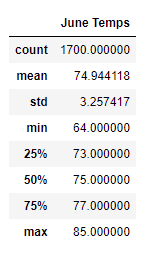
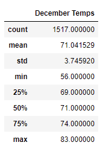

# surfs_up
SQLAlchemy

**Overview:** 
To determine if the surf and ice cream shop business is sustainable year-round in Oahu

**Results:**
3 key difference in weather between June and December
In June, Mean is 73.94, standard deviation is 3.25 and maximum temprature is 85  where as in December, Mean is 71.04, standard deviation is 3.74 and maximum temprature is 83.

**Summary:**
There's is not a big difference between the temperatures in June and December so, temperature should not be the only factor in considering the sustainability for the business.  The data for precipitation should be queried as well.  
